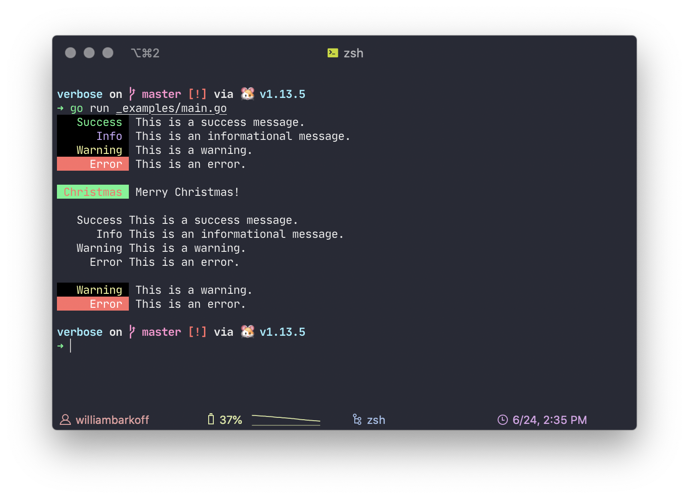

# Verbose
💬 Logs with a little bit of flavor

---

Verbose just prints logs in a _shiny_ way.



By default, Verbose includes 4 styles.
- Success
- Info
- Warning
- Error

Verbose also supports declaring your own style in a simple way:
```go
	xmas := verbose.Style{
		Foreground: 1,
		Background: 2,
		Text:       "Christmas",
		Level:      1,
	}
```

To print print, just call `Println` on a style.

```go
verbose.Success.Println("Yay, you just printed your first messages")
verbose.Error.Println("The world is imploding!")
xmas.Println("Merry Christmas!")
```

## Installation

Verbose is a go module. You can just run go get to install it.

```
$ go get -u github.com/willbarkoff/verbose
```

## Contributing
Contributions are welcome!

## Roadmap
In the future, I want to support more detailed log levels, and include more documentation.